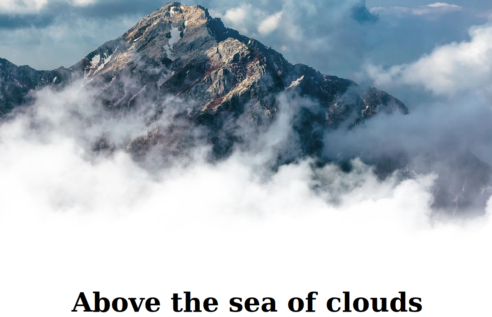

# 0010-above-the-sea-of-clouds
**Implementing moving clouds in CSS**

I was siting and I was trying to imagine what was the hero from **Wanderer above the Sea of Fog by Caspar David Friedrich** was seeing when he was on top of that mountain. And that is what I tried to comunicate through the use of CSS for the "hero" section of the web page. To transport the user in the shoes of that "Wanderer" who was watching from the highest mountain he was able to climb.   

To implement this effect in CSS I used:
- `@keyframes` at-rule together with `animation` property
- and I took advantage of CSS variables aswell

